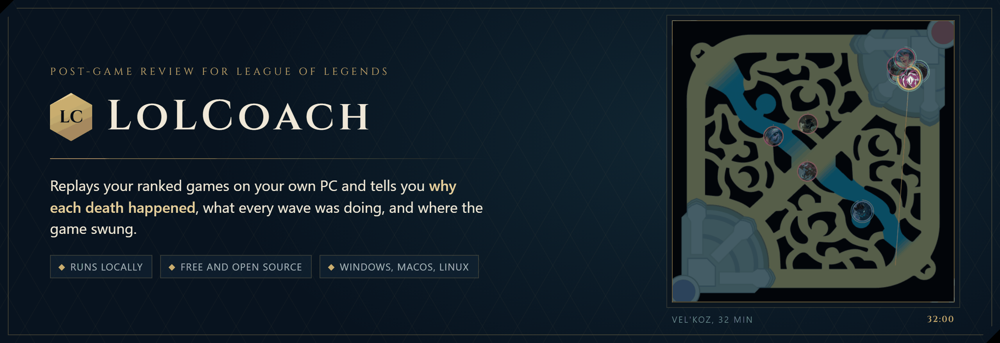
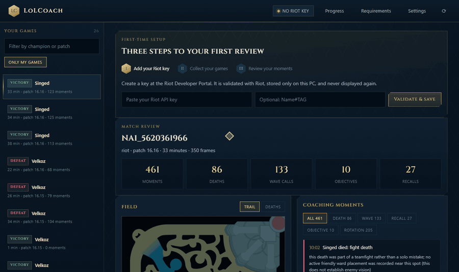

<p align="center">
  
</p>

# LoLCoach

**Replays your League of Legends games on your own PC and shows you why you died, what each wave was doing, and where the game slipped away.**

<p align="center">
  
</p>

<sub>A real recording of the v1.1 review app, made today on the author's own 26 ranked games. No Riot key was loaded for the recording, which is why the header says "No Riot key".</sub>

## Install

| Where | One line |
| --- | --- |
| **Windows** (PowerShell) | `irm https://raw.githubusercontent.com/Mattbusel/lolcoach/main/install.ps1 \| iex` |
| **macOS / Linux** | `curl -fsSL https://raw.githubusercontent.com/Mattbusel/lolcoach/main/install.sh \| sh` |
| **Homebrew** (macOS, Linux) | `brew install mattbusel/tap/lolcoach` |
| **Scoop** (Windows) | `scoop bucket add mattbusel https://github.com/Mattbusel/scoop-bucket; scoop install mattbusel/lolcoach` |
| **Just download it** | [Latest release](https://github.com/Mattbusel/lolcoach/releases/latest): unzip `lolcoach-review-...-windows-x86_64.zip` and double-click `LoLCoach.exe` |
| **With the AI chat** (Windows, 22 GB) | [Full bundle on Hugging Face](https://huggingface.co/Fungle/lolcoach-windows/resolve/main/LoLCoach-windows-x64.zip), see [below](#the-full-bundle-with-the-ai-coach-about-22-gb) |

Every installer above gets the same 20 MB review app and checks it against the release's `SHA256SUMS.txt`. Nothing touches the League client.

## Use it in 3 steps

1. **Start it.** Run `lolcoach` (or double-click `LoLCoach.exe`). Your browser opens `http://127.0.0.1:8765`, served only on your machine. Keep the small terminal window open; close it to quit.
2. **Connect your account.** Paste a free Riot API key from [developer.riotgames.com](https://developer.riotgames.com) and your Riot ID as `GameName#TAG`, then press **Validate & save**. The key is checked with Riot and stored only on this PC.
3. **Review.** Press **Sync my games**, pick a game on the left, press **Space** to replay the minimap, and click any coaching moment to jump to it. **Progress** shows the habit that costs you most across all your games.

## Results

What the app showed in today's recording, from 26 of the author's ranked games:

| | |
| --- | --- |
| Most expensive habit | Dying in teamfights: 171 of 234 deaths, 73% of the total |
| Trend | Improving, from 10.92 to 7.08 deaths per game |
| One 32 minute Vel'Koz game | 427 coaching moments, 133 wave calls, 10 objectives, 18 recalls |


---

## What it finds in your games

Most League tools show you statistics you already knew. LoLCoach reconstructs the decisions.

Riot's match timeline gives one snapshot per minute. From that, LoLCoach infers the things that actually decide games:

* **Wave states.** Whether a wave was freezing, slow pushing, crashing or bouncing, from champion positions, minion arithmetic and the exact spawn schedule.
* **Why you died.** Overextended, caught rotating, outnumbered, dived, no vision, or lost the trade, each with the evidence behind it.
* **Jungle paths.** Which camps were cleared and, from a Markov model built across your games, where that jungler probably went next.
* **Objective control.** Whether a dragon was taken for free or on a coinflip, scored from presence, vision and the fight that preceded it.
* **Where the game swung.** The single largest gold swing against you, and what caused it.

Every inference carries a confidence, because a one minute sampling grid genuinely cannot see everything. Low confidence renders as a low confidence bar, not as a confident sentence. A coach that bluffs is worse than no coach.

## Talk to it

The AI runs locally, so conversation is unlimited and costs nothing. The chat is in the [full bundle](#the-full-bundle-with-the-ai-coach-about-22-gb); the 20 MB review app says so plainly instead. Ask anything about any moment in any of your games.


When a game opens the coach already has something to say. It surfaces what is worth reviewing before you type a word, and each one is a button that asks the question for you.

## See your habits, not just your games

One game is an anecdote. LoLCoach aggregates every game you have played, finds the mistake that costs you most often, and tells you whether it is getting better or worse.


## Make it yours

Three coach personalities and four accent themes. The persona changes the voice only, never the standard of evidence.


## Downloads in detail

<details>
<summary><b>The review app (about 20 MB), per platform</b></summary>

Everything except the AI chat: your games, the minimap, gold curve, wave states, why each death happened, coaching moments and your progress across games. No GPU needed.

| Your computer | File to download |
| --- | --- |
| Windows 10 or 11 | `lolcoach-review-vX.Y.Z-windows-x86_64.zip` |
| Mac with Apple Silicon (M1 and later) | `lolcoach-review-vX.Y.Z-macos-arm64.tar.gz` |
| Mac with Intel | `lolcoach-review-vX.Y.Z-macos-x86_64.tar.gz` |
| Linux | `lolcoach-review-vX.Y.Z-linux-x86_64.tar.gz` |

The app is not code-signed, so Windows SmartScreen may say "Windows protected your PC" or "unknown publisher". Click **More info**, then **Run anyway**. On a Mac, right-click `LoLCoach` and choose **Open** the first time (or run `xattr -d com.apple.quarantine LoLCoach`). The install scripts and Homebrew avoid both prompts.

Options: `lolcoach --port 9000` if 8765 is taken, `lolcoach --no-browser` to start the server only, `lolcoach --help` for the rest. Your data is kept in `%LOCALAPPDATA%\LoLCoach\data` on Windows and `~/AppData/Local/LoLCoach/data` elsewhere, or wherever `LOLCOACH_HOME` points.

</details>

### The full bundle with the AI coach (about 22 GB)

The full bundle contains the app, the Python runtime, the trained adapter, the retrieval index and the Qwen2.5-7B model. It is roughly 22 GB because the model ships inside it, which is what lets it work offline after the first launch.

**[Download LoLCoach-windows-x64.zip](https://huggingface.co/Fungle/lolcoach-windows/resolve/main/LoLCoach-windows-x64.zip)** (22.2 GB), or resume-safe from the command line:

```bash
pip install huggingface_hub
huggingface-cli download Fungle/lolcoach-windows LoLCoach-windows-x64.zip --local-dir .
```

Extract the zip anywhere, keep the folder together, and run `LoLCoach.exe`. It ships with an empty match library, so you sync your own games on first run. It is hosted on Hugging Face because GitHub caps release assets at 2 GB per file; see [DISTRIBUTION.md](DISTRIBUTION.md).

<details>
<summary><b>pipx and building from source</b></summary>

For the command line pipeline (`lolcoach download_data`, `train`, `ui` and the rest):

```bash
pipx install git+https://github.com/Mattbusel/lolcoach
lolcoach ui
```

This installs the full dependency list, including PyTorch and transformers, so it is a multi-gigabyte install, and its `lolcoach` command is the full pipeline CLI rather than the review app launcher. LoLCoach is not on PyPI.

**The full bundle.** Needs Python 3.12 and an NVIDIA GPU:

```powershell
git clone https://github.com/Mattbusel/lolcoach.git
cd lolcoach
python -m pip install -e ".[ui,bundle]"
powershell -ExecutionPolicy Bypass -File scriptsuild_windows.ps1
```

The bundle lands in `dist\LoLCoach\`. Double click `LoLCoach.exe`.

**The review app only**, without PyTorch (this is what the release workflow builds):

```powershell
python -m pip install -r packaging/requirements-review.txt pyinstaller
python -m pip install --no-deps .
python -m PyInstaller --onefile --console --name LoLCoach --paths . --add-data "configs:configs" --add-data "lolcoach/web:lolcoach/web" --collect-submodules lolcoach --collect-submodules uvicorn lolcoach/launcher.py
```

</details>

## System requirements

The app checks your own machine. Open it and click **Requirements**.


**To review your games**, no GPU needed:

| | |
| --- | --- |
| Operating system | Windows 10 or 11, 64 bit |
| Memory | 8 GB RAM |
| Disk | 8 GB free, growing with the games you collect |
| Riot API key | Free from [developer.riotgames.com](https://developer.riotgames.com). A development key expires every 24 hours |

**To chat with the AI coach:**

| | |
| --- | --- |
| GPU | NVIDIA with 8 GB VRAM or more, RTX 3060 or 4060 and up |
| Memory | 16 GB RAM |
| Disk | 20 GB free for the bundled model |
| Driver | Recent NVIDIA driver with CUDA 12 support |

Without a supported GPU the full match review still works. Only the chat is slow or unavailable.

## How it works

```
Riot API  ->  SQLite  ->  feature inference  ->  training data  ->  QLoRA fine tune
                              |                                          |
                              +--------> review UI <---- RAG <-----------+
```

| Stage | What happens |
| --- | --- |
| Collect | Riot match timelines, Data Dragon static data, the League wiki, patch notes, community discussion |
| Infer | Wave states, lane priority, trades, recalls, jungle paths, objective control, death causes, rotations |
| Build | Instruction examples assembled from the recorded reasoning, deduplicated and split |
| Retrieve | FAISS index over the corpus, hybrid dense plus IDF weighted lexical, patch aware |
| Train | QLoRA on Qwen2.5-7B, VRAM aware hyperparameters, per epoch checkpoints, resumable |
| Review | Local web app with minimap, gold curve, wave ribbon, coaching moments and streaming chat |

Command line:

```
lolcoach download_data      Collect from every configured source
lolcoach prepare_dataset    Ingest, infer features, write train/val/test JSONL
lolcoach train              Fine tune the adapter
lolcoach benchmark          Score against GPT, Claude and DeepSeek
lolcoach chat               Ask a question from the terminal
lolcoach rag --build        Rebuild the retrieval index
lolcoach update_patch       Refresh static data after a patch
lolcoach ui                 Open the review app
lolcoach doctor             Check this machine
```

## Honest limitations

* **Live coaching is limited.** Riot's Live Client Data API does not expose champion coordinates, so wave position and jungle tracking cannot be inferred during a game. Post game review has full fidelity.
* **A development Riot key expires every 24 hours.** Production keys require an application to Riot.
* **The wave estimate is an estimate.** Timeline frames are 60 seconds apart, which is exactly why confidence is shown.
* **The model is small.** A 7B model fine tuned on your games beats frontier models on the specific decisions it was trained on and loses to them on open ended League conversation.

## Data and licensing

The MIT licence covers this repository's code only. It does not grant rights to redistribute models, collected data or game assets.

| Source | Use | Restriction |
| --- | --- | --- |
| Riot Data Dragon and Riot API | Static data, your authorised match history | Riot terms apply. Riot does not endorse this project |
| League of Legends Wiki | Mechanics and patch history | CC BY-SA 4.0, attribution preserved |
| Oracle's Elixir | Professional match data | Non commercial use with credit |
| Reddit via Arctic Shift | Community coaching discussion | Content remains its authors' property |
| Cinzel typeface | Display headings | SIL Open Font License, included in `lolcoach/web/fonts/` |

Every downloaded file is recorded with its URL, hash, source and licence. The dataset card is generated from that ledger rather than written by hand.

This project does not scrape VODs, does not bypass platform authentication and does not decrypt replay files.

## Development

```powershell
python -m pip install -e ".[ui,judges]"
python -m pytest          # 89 tests
python -m lolcoach.cli ui
```

The tests that matter most are in `tests/test_features.py`. They script game situations with known answers, a freeze on top and a slow push into a crash on mid, then assert the estimators recover them.

A deeper technical write up of the pipeline is in [docs/README-technical.md](docs/README-technical.md).

## Licence

MIT for the code. See [LICENSE](LICENSE).

League of Legends is a trademark of Riot Games, Inc. This project is not affiliated with or endorsed by Riot Games.
